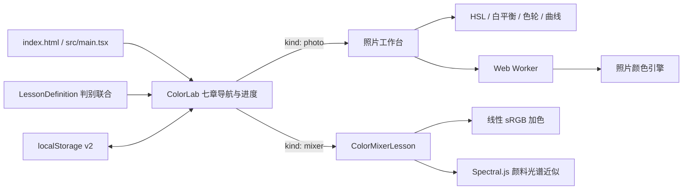

# PROJECT_PROGRESS

> 项目：色彩暗房（Color-darkroom）  
> 最近更新：2026-09-07  
> 当前阶段：七章课程与混色教程已完成，进入 GitHub Pages 线上回归阶段。

## 1. 项目目标与边界

「色彩暗房」是面向摄影初学者的中文交互式色彩学习工具。前五章通过教学样片和实时照片调节建立后期基础，第六、七章通过预测练习与自由调色盘比较光色加色、颜料减色及 tint、tone、shade。

- 单页、纯客户端 React 应用，无账户、数据库和服务端业务。
- 用户图片仅在浏览器内存中处理，不上传、不持久化。
- 照片课程使用 Canvas + Web Worker；混色课程使用独立纯函数，不进入照片像素管线。
- 学习进度保存于 `color-darkroom.progress.v2`，可从 v1 自动迁移。
- 浏览器 sRGB 和光谱混色均为学习预览，不等同于专业 RAW 软件或真实颜料打样。

## 2. 技术栈

| 层级 | 当前实现 |
| --- | --- |
| 应用 | React 19、TypeScript、Vite 8 |
| UI | Tailwind CSS 4、shadcn/ui、Base UI、Lucide |
| 照片处理 | Canvas、ImageData、Web Worker |
| 混色 | 线性 sRGB 加色、Spectral.js 3.0.0 |
| 状态持久化 | localStorage v2 |
| 测试 | Vitest、jsdom、Testing Library |
| 部署 | GitHub Actions、GitHub Pages |
| 包管理 | npm、package-lock.json |

Node.js 要求为 `^22.22.2 || ^24.15.0 || >=26.0.0`，与 jsdom 测试依赖一致；CI 使用 22.22.2。GitHub Pages 基路径固定为 `/Color-darkroom/`。

## 3. 总体架构

架构约束：

- `PhotoLessonDefinition` 保留原样片、控件与参数任务；现有五章只新增 `kind: 'photo'`。
- `MixerLessonDefinition` 独立保存混色模型、预设与练习；不向 `AdjustmentState` 塞入混色字段。
- 进入混色章节时终止照片 Worker，不发送图片或渲染消息；返回照片章节时按原流程重新初始化。
- 导入照片的 Blob URL 和名称仍保留在 `ColorLab` 内存中，章节往返不会丢失。
- `workers/`、`lib/color-engine.ts` 和 `lib/defaults.ts` 在本次扩展中未修改。

## 4. 目录与职责

| 路径 | 主要职责 |
| --- | --- |
| `index.html`、`src/main.tsx` | Vite HTML 与 React 入口 |
| `app/globals.css` | 暗房主题与响应式布局 |
| `components/color-lab.tsx` | 七章导航、v2 进度、照片状态和工作台分支 |
| `components/color-mixer-lesson.tsx` | 预测练习、自由调色盘、两种混色模型的 UI |
| `components/adjustment-controls.tsx` | 原五章照片调节控件 |
| `lib/types.ts` | 判别课程联合、混色与 Worker 消息类型 |
| `lib/lessons.ts` | 七章课程、六道混色练习和候选答案 |
| `lib/color-engine.ts` | 原照片颜色公式与像素管线 |
| `lib/color-mixing.ts` | 加色、颜料混色、HEX/RGB/HSL 与中文描述 |
| `lib/learning.ts` | 照片评分、v1→v2 迁移、完成规则和竞态判定 |
| `workers/image-worker.ts` | 原始照片像素缓存与异步渲染 |
| `tests/` | 照片引擎、混色、进度和组件回归 |
| `THIRD_PARTY_NOTICES.md` | Spectral.js MIT 许可与归属 |

## 5. 七章课程状态

| 章节 | 内容 | 状态 |
| --- | --- | --- |
| 第一章 | 色相、饱和度、明度 | 已完成 |
| 第二章 | 色温、色调与白平衡 | 已完成 |
| 第三章 | 互补色、邻近色与双锚点映射 | 已完成并修复 |
| 第四章 | 六色带分颜色 HSL | 已完成 |
| 第五章 | RGB 曲线与冷暖分离色调 | 已完成 |
| 第六章 | RGB 光色加色混合 | 已完成 |
| 第七章 | 颜料减色与 tint、tone、shade | 已完成 |

第六、七章各有三道固定预测题。预测前结果隐藏；答错后显示结果、解释和“再试一次”；答对后逐题保存。三题全部完成才标记章节完成。自由模式支持两个颜色槽和可删除的第三槽，不计分、不持久化。

## 6. 混色实现

### 光色

1. HEX 解码为 sRGB。
2. 按标准 gamma 公式转换到线性光空间。
3. 按每个光源的独立强度相加。
4. 通道裁剪到 0～1 后编码回 sRGB。
5. 全部强度为零时结果为黑色。

### 颜料

1. 收集已启用的 2～3 个颜料槽。
2. 将非负份数归一化；全部为零时回退为等份。
3. 调用本地依赖 Spectral.js 3.0.0 的 Kubelka–Munk 光谱近似。
4. 蓝黄等份样例得到 `#3D933E` 绿色系结果。

### 中文描述

固定边界识别黑、白、灰阶、灰调、鲜明、深色和浅色，并将色相分为红、橙、黄、黄绿、绿、青、蓝、紫、洋红九区，组合出“浅暖灰橙调”一类描述。

## 7. 进度兼容

`ProgressState.version` 已升级到 2：

- `currentLesson`
- `completedLessons`
- `completedExercises`
- `updatedAt`

启动时优先读取 `color-darkroom.progress.v2`；不存在时读取 v1。迁移保留原当前章节和五章完成状态，逐题列表初始化为空。旧键不会删除。恢复时会过滤非字符串、未知和重复的章节或练习 ID。已有五章全完成的用户迁移后显示 `5 / 7`。

## 8. 测试与验收

2026-09-07 最终实际执行：

| 命令 | 结果 |
| --- | --- |
| `npm run typecheck` | 通过 |
| `npm test` | 通过：5 个测试文件、46 项测试（含审核修复回归） |
| `npm run build` | 通过：主资源与独立照片 Worker 均生成 |
| `npm run dev -- --host 127.0.0.1` | 通过：Vite 启动于 `/Color-darkroom/` |

开发服务器验收时 5173 已被占用，Vite 自动使用 5174；页面标题与课程样片均返回 HTTP 200。

自动化覆盖：

- 原有 18 项照片颜色、像素、任务、进度与竞态测试继续通过。
- RGB 两两加色、三原色白光、零强度、裁剪与 gamma 往返。
- Spectral.js 蓝黄混绿、比例端点、三色混合与全零回退。
- 黑白、灰阶、明暗、鲜灰和九个色相区间。
- 六道预测题答案、解释存在性及三题完成规则。
- v1→v2、损坏数据、未知/重复 ID 和逐题恢复。
- 预测隐藏、错误重试、正确保存、键盘选择、第三色添加/删除。
- 导入照片进入混色章节后隐藏、返回照片章节后仍保留。

2026-09-07 审核修复补充：

- 预测结果按线性 sRGB 相对亮度选择黑/白文字，修复黄光、青光文字对比度。
- 末题完成后进入自由调色盘，返回预测仍保留揭晓状态，不再循环隐藏末题。
- Tint、Tone、Shade 展示蓝色分别与白、灰、黑混合的三组配方与独立计算结果。
- 原生颜色选择器修改后使用“自定义颜色 A/B/C”，避免继续显示旧预设名称。
- Node 支持范围与现有 jsdom 对齐，package.json、锁文件、README 和 CI 同步更新。
- 本轮使用 Node 24.19.0 实际通过类型检查、46 项测试和构建；未修改照片处理管线。
- 本轮未重跑开发服务器、浏览器人工检查或远程 GitHub Actions；以下为此前验收记录，不代表修复后复验。

此前人工浏览器检查：

- 桌面三栏和中等宽度双栏布局正常。
- 390×844 手机视口为纵向完整布局。
- 第六章预测、自由调色盘和第七章白/灰/黑快捷操作可用。
- GitHub Pages 子路径形式的本地地址、样片请求正常。
- 浏览器控制台无 warning/error。

## 9. 许可、假设与限制

- Spectral.js 3.0.0 依 MIT 许可证使用，版权与全文见 `THIRD_PARTY_NOTICES.md`。
- 未复制 Palette Lab、ryb-color-mixer 或 Color Theory Wheel 的源码；Mixbox 未集成。
- 颜料显示是屏幕上的光谱近似，真实混合会受颜料材质、浓度、纸张和光源影响。
- 不支持 RAW、精确 ICC、成片导出、撤销历史、账户或云存储。
- 用户图片刷新后仍需重新导入。

## 10. Git 与部署状态

既有里程碑：

| 提交 | 内容 |
| --- | --- |
| `638b4b6` | 建立学习站点、Worker、课程逻辑和基础测试 |
| `74d6376` | 修复灰色饱和度异常和 Worker 地址 |
| `242fef6` | 迁移 React + Vite 并添加 GitHub Pages 工作流 |
| `0f36cb1` | 修复第三章只评分、不改变图像的问题 |

本轮七章扩展当前位于工作树，尚未提交或推送。现有 GitHub Pages Actions 工作流保持不变；线上部署状态本次未核验。

## 11. 下一步

1. 审查并提交本轮七章扩展。
2. 推送 `main`，观察 Pages Actions 构建与发布。
3. 在线上 Pages 地址回归六道练习、逐题恢复、样片和 Worker。
4. 之后再评估浏览器 E2E 与真实移动设备测试，不在本轮扩大业务范围。

## 12. 维护约定

仅在架构、核心实现、测试结果、部署状态、重要决定、风险或下一步优先级发生实质变化时更新本文件。不得把计划中尚未验证的功能写成已完成。
